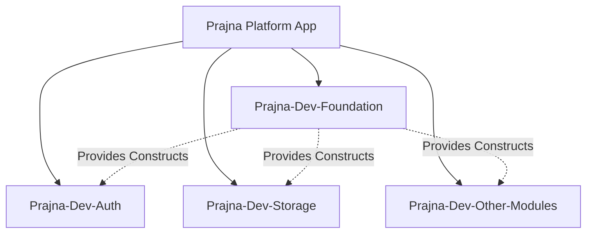
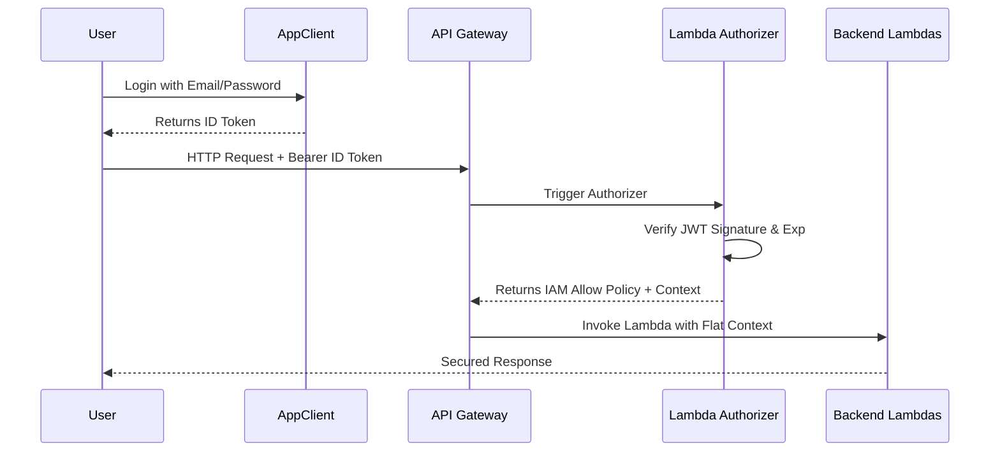
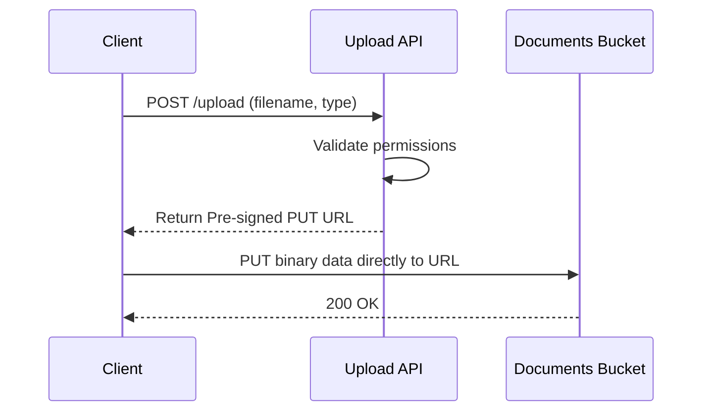
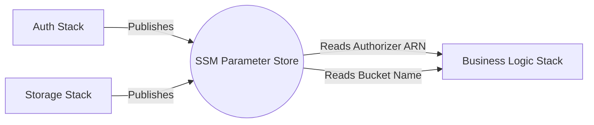

# PRAJNA Platform Infrastructure Documentation

## 1. Executive Summary

This document outlines the architecture, design patterns, and deployment details for the core foundational modules of the PRAJNA Platform:
* **Module 1 (CDK Foundation)**: Establishes enterprise-grade AWS CDK constructs, environment configurations, naming conventions, and tagging standards.
* **Module 3 (Auth & User Management)**: Provisions Amazon Cognito user pools, application clients, user groups, custom attributes, and a centralized API Gateway Lambda Authorizer.
* **Module 6 (File Storage & Document Vault)**: Provisions secure S3 buckets for document uploads and system exports, complete with secure pre-signed URL generation.

### Deployment Status
* **Status**: Deployed and Synthesized Successfully
* **AWS Region**: `ap-south-1` (Mumbai)
* **Environment Strategy**: Multi-account isolation strategy provisioning across `dev`, `qa`, and `prod` stages. Each stage is mapped to a distinct AWS account via the `lib/foundation/config/` definitions.

---

## 2. Module 1 – CDK Foundation

Module 1 enforces consistent security, compliance, and infrastructure patterns across all other PRAJNA modules.

### Shared Constructs
All platform modules MUST utilize the following shared constructs rather than raw `aws-cdk-lib` resources to ensure security baseline inheritance:
* **SharedRole**: IAM Roles with strict boundary policies.
* **SharedParameter**: Standardized SSM Parameter Store publishing.
* **SharedBucket**: S3 buckets with mandatory encryption, public-access-blocking, and SSL enforcement.
* **SharedLambda**: Lambda functions with standardized runtimes, timeouts, log retention, and X-Ray tracing.
* **SharedLogGroup**: CloudWatch Log Groups with environment-specific retention policies.
* **SharedAlarm**: Standardized CloudWatch Alarms.
* **SharedApi**: Baseline API Gateway constructs.

### Environment Configuration
The platform utilizes a typed `getEnvironmentConfig` loader that resolves environment-specific properties at synth-time.
* **Environment Loader**: `lib/foundation/config/index.ts`
* **Stage Resolution**: Exhaustively resolves `Stage.DEVELOPMENT`, `Stage.QA`, `Stage.PRODUCTION`.
* **Account/Region**: Mapped dynamically per environment to ensure cross-account deployment safety.

### Naming Standards
Resource naming follows strict determinism via `ResourceNames` helpers:
* **Stack Naming**: `Prajna-<Stage>-<Module>` (e.g., `Prajna-Dev-Auth`)
* **S3 Naming**: `prajna-<stage>-<module>-s3-<identifier>-<account>`
* **SSM Naming**: `/prajna/<stage>/<module>/<identifier>`
* **Log Group Naming**: `/aws/lambda/prajna-<stage>-<module>-fn-<identifier>`

### Tagging Standards
Every provisioned AWS resource is required to carry the following tags (enforced via `PrajnaTags.applyToStack`):
1. **Application**: `PRAJNA - AI Powered Faculty Companion Platform`
2. **Project**: `prajna`
3. **Environment**: Deployment stage (`dev`, `qa`, `prod`)
4. **Module**: Owning module identifier
5. **Owner**: `PRAJNA Platform Team`
6. **ManagedBy**: `AWS-CDK`
7. **CostCenter**: `PRAJNA-CC-001`
8. **Version**: Platform Version (e.g., `1.0.0`)

### Cross-Stack Discovery
To prevent tight CloudFormation coupling (export/import limits) and cyclical dependencies, the platform exclusively uses **AWS Systems Manager (SSM) Parameter Store** for cross-module resource discovery. Modules publish ARNs/Names as `StringParameter` values, and consuming stacks read them dynamically.

---

## 3. Module 3 – Auth & User Management

### Cognito Architecture
* **User Pool**: The central identity provider configured with email-based authentication and strict password policies.
* **App Client**: An OAuth 2.0 Web Client configured with Authorization Code Grant (PKCE) specifically designed for the SPA frontend (no client secret).
* **Groups**: Role-Based Access Control (RBAC) definitions.

### Cognito Groups
Users are mapped to standard platform groups:
* `ADMIN`
* `PVC` (Pro-Vice Chancellor)
* `IQAC`
* `DIRECTOR`
* `HOD` (Head of Department)
* `FACULTY`

### Custom JWT Claims
PRAJNA extends the standard OpenID scope with custom identity attributes:
* `custom:role`
* `custom:campus`
* `custom:department`
* `custom:facultyId`

### Lambda Authorizer
A centralized Lambda function (`prajna-dev-auth-fn-authorizer`) designed to be attached to any API Gateway in the platform.
* **ID Token Validation**: Explicitly verifies standard Cognito ID Tokens.
* **aws-jwt-verify**: Utilized for highly optimized signature verification.
* **JWKS Caching**: The public keys (JWKS) of the User Pool are cached in the Lambda execution context memory, drastically reducing latency during warm invocations.
* **Authorizer Lambda Flow**: Extracts `Bearer` token -> Verifies signature/expiration -> Extracts custom claims -> Generates IAM `Allow` policy -> Injects context for downstream Lambdas.

### Authorizer Context Contract
The claims are extracted and injected into the API Gateway event.
**Exact Runtime Format**:
```json
{
  "principalId": "<facultyId>",
  "userId": "<facultyId>",
  "role": "<custom:role>",
  "campusId": "<campusId>",
  "campus": "<custom:campus>",
  "departmentId": "<departmentId>",
  "department": "<custom:department>",
  "facultyId": "<custom:facultyId>"
}
```

Because API Gateway requires a **FLAT** structure for context variables, downstream Lambdas access these variables via:
* `event.requestContext.authorizer.userId`
* `event.requestContext.authorizer.role`
* `event.requestContext.authorizer.campusId`
* `event.requestContext.authorizer.campus`
* `event.requestContext.authorizer.departmentId`
* `event.requestContext.authorizer.department`
* `event.requestContext.authorizer.facultyId`

**Data Normalization & Resolution**:
* **Role Tie-Breaker**: If a user belongs to multiple Cognito groups, their `role` context variable is resolved using a strict ranking system (`ADMIN(4) > PVC/PROVC/IQAC(3) > DIRECTOR(2) > HOD(1) > FACULTY(0)`).
* **Campus & Department Normalization**: The authorizer normalizes raw strings (e.g., "CSE" or "Computer Science") into standard `id` and `name` pairs (`campusId`/`campus` and `departmentId`/`department`).

### Published SSM Parameters
* `/prajna/dev/auth/user-pool-id`
* `/prajna/dev/auth/user-pool-arn`
* `/prajna/dev/auth/user-pool-client-id`
* `/prajna/dev/auth/authorizer-lambda-arn`
* `/prajna/dev/auth/authorizer-lambda-name`

---

## 4. Module 6 – File Storage & Document Vault

### Storage Architecture
* **Documents Bucket**: Faculty document vault for CVs, certificates, and publications. Supports browser-based CORS pre-signed uploads.
* **Exports Bucket**: Stores system-generated reports, bulk exports, and downloadable artifacts.

### Security Controls
* **AES-256 Encryption**: S3-managed server-side encryption is mandated by default.
* **SSL Enforcement**: Denies `s3:*` operations where `aws:SecureTransport` is false.
* **Block Public Access**: Hard-blocked via `BlockPublicAccess.BLOCK_ALL`.
* **Bucket Ownership Enforcement**: ACLs disabled, ownership enforced to bucket owner.

### Upload Flow
To keep the API Gateway payload small and avoid Lambda binary limitations, uploads utilize **Pre-signed PUT URLs**.
1. Client requests upload URL via `/upload-url`
2. Backend Lambda generates short-lived S3 pre-signed URL.
3. Client executes direct `PUT` to S3 via the generated URL.

### Download Flow
To ensure objects remain deeply private, downloads utilize **Pre-signed GET URLs**.
1. Client requests document view via `/download-url`.
2. Backend validates access rights, generates short-lived GET URL.
3. Client fetches file directly from S3 using the URL.

### Bucket Structure Recommendation
```text
/
├── approvals/
├── faculty/
├── iqac/
└── departments/
```

### Published SSM Parameters
* `/prajna/dev/storage/documents-bucket-name`
* `/prajna/dev/storage/documents-bucket-arn`
* `/prajna/dev/storage/exports-bucket-name`
* `/prajna/dev/storage/exports-bucket-arn`
* `/prajna/dev/storage/upload-lambda-arn`
* `/prajna/dev/storage/download-lambda-arn`

---

## 5. Cross-Module Integration Guide

Modules should strictly avoid hardcoding ARNs or Bucket Names. Use CDK `StringParameter` imports to resolve dependencies at synthesis time. All canonical SSM paths are defined in the Foundation layer (`lib/foundation/constants/ssm-parameters.ts`), which acts as the cross-team integration registry (e.g., `SsmPaths.Auth.*`, `SsmPaths.Storage.*`, `SsmPaths.Approval.*`).

### TypeScript Examples (CDK Integration)

**How to read the Authorizer ARN (For API Gateway Attachment):**
```typescript
import { StringParameter } from 'aws-cdk-lib/aws-ssm';

const authorizerArn = StringParameter.fromStringParameterName(
  this, 
  'AuthorizerArn', 
  `/prajna/${stage}/auth/authorizer-lambda-arn`
).stringValue;
```

**How to read the Documents Bucket Name (For IAM Policy Grants):**
```typescript
const bucketName = StringParameter.fromStringParameterName(
  this,
  'DocsBucketName',
  `/prajna/${stage}/storage/documents-bucket-name`
).stringValue;
```

**How to use Foundation Constructs (Internal to Repo):**
```typescript
import { SharedLambda } from '../foundation/constructs/shared-lambda';

const myLambda = new SharedLambda(this, 'MyFunction', {
  config,
  module: ModuleIdentifier.BUSINESS_LOGIC,
  identifier: 'process-report',
  entry: 'src/logic/index.ts',
});
```

---

## 6. Deployment Outputs

The following resources are currently active in the `dev` environment (`ap-south-1`).

| Resource | Deployed Value |
| --- | --- |
| **User Pool ID** | `ap-south-1_xmCx0Tkag` |
| **App Client ID** | `arqm12fipu8n9t2e59v8psr35` |
| **Region** | `ap-south-1` |
| **Documents Bucket Name** | `prajna-dev-storage-s3-documents-518733265814` |
| **Exports Bucket Name** | `prajna-dev-storage-s3-exports-518733265814` |

---

## 7. Architecture Diagrams

### Foundation Architecture


### Authentication Flow


### File Upload Flow


### Cross-Module SSM Discovery


---

## 8. Testing & Validation

The core infrastructure modules achieve extensive testing coverage using AWS CDK assertions.

* **Test Suites Passing**: 6 / 6
* **Unit Tests Passing**: 100 / 100
* **Code Coverage**: ~85.7% overall lines (Auth and Storage logic 100% covered).
* **Synthesis Validation**: `npx cdk synth` passes cleanly for all stacks (`Prajna-Dev-Foundation`, `Prajna-Dev-Auth`, `Prajna-Dev-Storage`).
* **Deployment Validation**: Deployed parameter outputs verified dynamically against active AWS Account.

---

## 9. Future Roadmap

* **Multi-Factor Authentication (MFA)**: Activating TOTP/SMS validation on the Cognito User Pool for elevated groups.
* **External IdPs**: Enabling Google Workspace/SAML federated login for faculty ease of access.
* **Virus Scanning Pipeline**: Connecting an EventBridge trigger to the Documents S3 Bucket for automated ClamAV scanning upon document upload.
* **Document Metadata Service**: Syncing S3 object keys into DynamoDB to track upload state and approval status.
