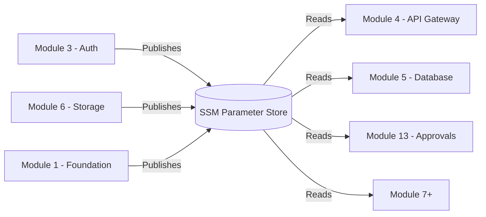
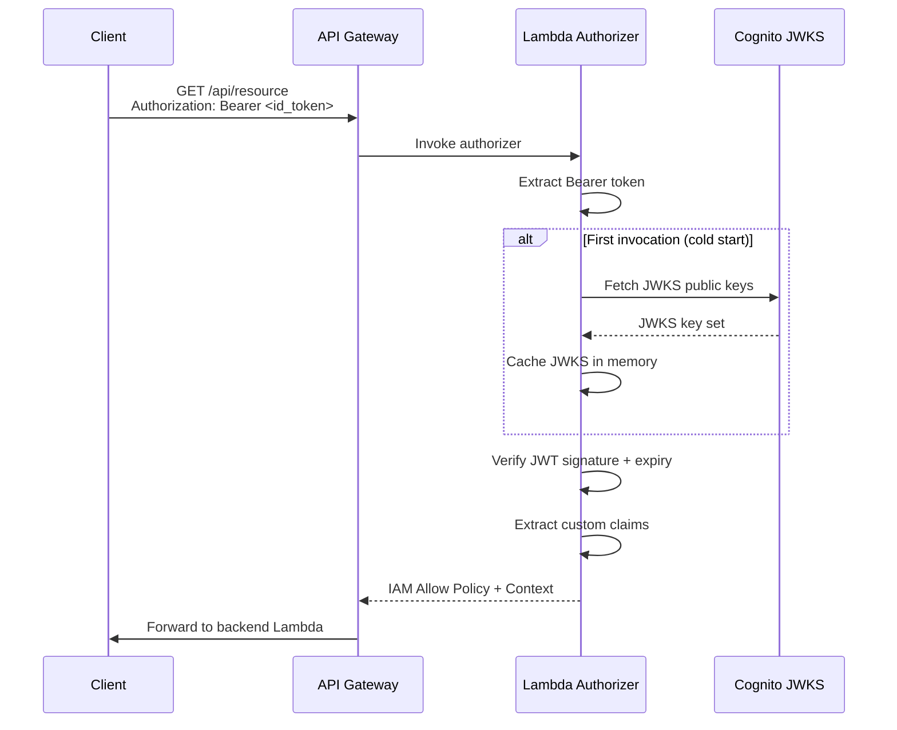
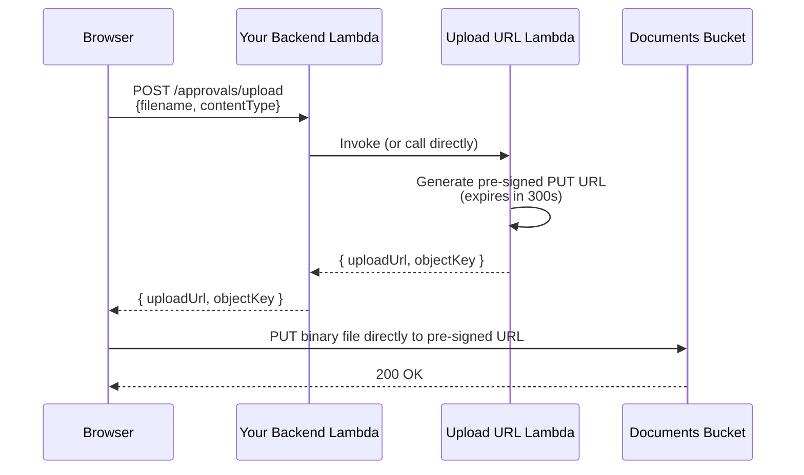
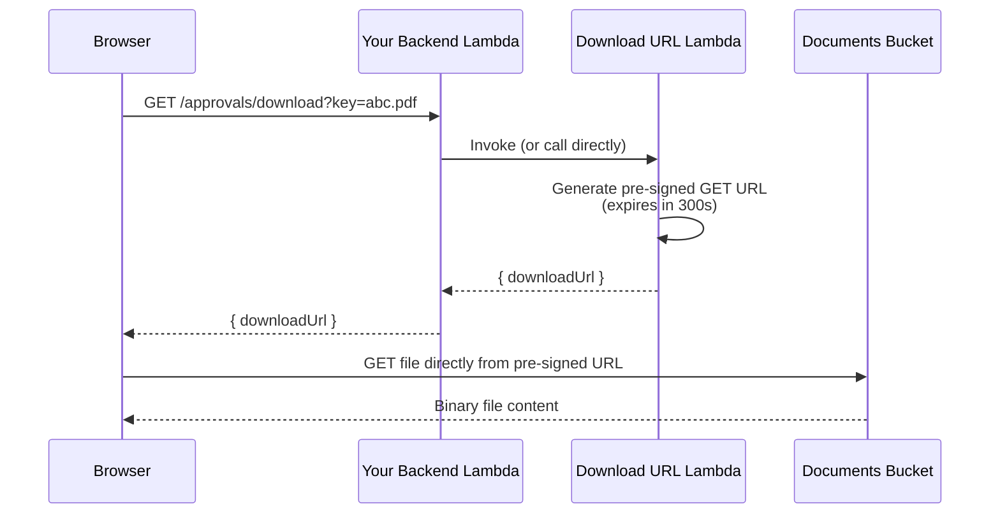

# PRAJNA Platform Integration Guide

> **Author:** Balaji (Module 1 / Module 3 / Module 6 Owner)
> **Last Updated:** 2026-06-24
> **Platform Version:** 1.0.0

---

## Executive Summary

The following foundational modules are **complete and deployed** to the `dev` environment in `ap-south-1`:

| Module | Name | Status |
| --- | --- | --- |
| **Module 1** | CDK Foundation | ✅ Deployed |
| **Module 3** | Auth & User Management | ✅ Deployed |
| **Module 6** | File Storage & Document Vault | ✅ Deployed |

**All cross-module integration MUST use SSM Parameter Store.** Do not hardcode ARNs, bucket names, or resource IDs. Import them at synth/deploy time using the SSM helpers documented below.



---

# Module 1 – Foundation

Module 1 provides shared CDK constructs, environment configuration, naming conventions, and tagging standards that **every module must use**.

## Shared Constructs Available

All constructs live under `lib/foundation/constructs/`. Import them using relative paths from your module:

```typescript
// Example: from lib/approvals/approval-stack.ts
import { SharedLambda } from '../foundation/constructs/shared-lambda';
import { SharedBucket } from '../foundation/constructs/shared-bucket';
import { SharedParameter } from '../foundation/constructs/shared-parameter';
```

---

### SharedLambda

| Property | Value |
| --- | --- |
| **Purpose** | Create Lambda functions with all platform standards pre-applied |
| **When to use** | Every time you need a Lambda function |
| **Source** | `lib/foundation/constructs/shared-lambda.ts` |

**What it enforces automatically:**
- Node.js 22 runtime (ARM64 Graviton2)
- AWS X-Ray active tracing
- Structured logging via Powertools environment variables
- Dedicated CloudWatch Log Group with environment-appropriate retention
- IAM execution role with BasicExecution and X-Ray policies
- Platform tags

**Example:**

```typescript
import { SharedLambda } from '../foundation/constructs/shared-lambda';
import * as lambda from 'aws-cdk-lib/aws-lambda';
import * as iam from 'aws-cdk-lib/aws-iam';
import * as path from 'path';

const processReport = new SharedLambda(this, 'ProcessReport', {
  config,
  module: ModuleIdentifier.APPROVAL,
  identifier: 'process-report',
  description: 'Processes submitted approval reports',
  entry: path.join(__dirname, '../../src/approval/process-report/index.ts'),
  code: lambda.Code.fromAsset('dist/approval/process-report'),
  environment: {
    TABLE_NAME: 'my-table',
  },
  policyStatements: [
    new iam.PolicyStatement({
      actions: ['dynamodb:PutItem'],
      resources: ['arn:aws:dynamodb:*:*:table/my-table'],
    }),
  ],
});

// Access the underlying Lambda function:
processReport.function.addEnvironment('EXTRA_VAR', 'value');
```

> **⚠️ Important:** SharedLambda uses `Code.fromAsset()`, which uploads a directory as-is. The `entry` prop is for documentation/path tracking. You **must** provide a pre-compiled JavaScript directory via the `code` prop. TypeScript `.ts` files passed directly as `entry` without a `code` override will throw an error.

---

### SharedRole

| Property | Value |
| --- | --- |
| **Purpose** | Create IAM Roles with consistent naming, tagging, and policy attachment |
| **When to use** | Every time you need an IAM role (Lambda execution, service role, etc.) |
| **Source** | `lib/foundation/constructs/shared-role.ts` |

**Example:**

```typescript
import { SharedRole } from '../foundation/constructs/shared-role';
import * as iam from 'aws-cdk-lib/aws-iam';

// Convenience factory for Lambda execution roles:
const lambdaRole = SharedRole.forLambda(this, 'MyLambdaRole', {
  config,
  module: ModuleIdentifier.APPROVAL,
  identifier: 'processor-exec',
  description: 'Execution role for the approval processor Lambda',
  xrayEnabled: true,
});

// General-purpose role:
const serviceRole = new SharedRole(this, 'ServiceRole', {
  config,
  module: ModuleIdentifier.APPROVAL,
  identifier: 'step-functions-exec',
  assumedBy: new iam.ServicePrincipal('states.amazonaws.com'),
  description: 'Execution role for the approval workflow state machine',
});
```

---

### SharedParameter

| Property | Value |
| --- | --- |
| **Purpose** | Publish resource metadata (ARNs, names, endpoints) to SSM Parameter Store |
| **When to use** | Every time your module exposes a resource that other modules need |
| **Source** | `lib/foundation/constructs/shared-parameter.ts` |

**Example — Publishing:**

```typescript
import { SharedParameter } from '../foundation/constructs/shared-parameter';

new SharedParameter(this, 'WorkflowArnParam', {
  config,
  module: ModuleIdentifier.APPROVAL,
  identifier: 'workflow-arn',
  description: 'Approval workflow Step Functions state machine ARN',
  value: stateMachine.stateMachineArn,
});
// Creates: /prajna/dev/approval/workflow-arn
```

**Example — Reading (synth-time lookup):**

```typescript
import { SharedParameter } from '../foundation/constructs/shared-parameter';

const userPoolId = SharedParameter.valueFromLookup(
  this,
  'UserPoolIdLookup',
  '/prajna/dev/auth/user-pool-id',
);
```

**Example — Reading (deploy-time token):**

```typescript
import { SharedParameter } from '../foundation/constructs/shared-parameter';

const bucketName = SharedParameter.valueForStringParameter(
  this,
  '/prajna/dev/storage/documents-bucket-name',
);
```

---

### SharedBucket

| Property | Value |
| --- | --- |
| **Purpose** | Create S3 buckets with mandatory encryption, public-access blocking, and SSL enforcement |
| **When to use** | Every time you need an S3 bucket |
| **Source** | `lib/foundation/constructs/shared-bucket.ts` |

**What it enforces automatically:**
- `BlockPublicAccess.BLOCK_ALL` (no override)
- Server-side encryption (S3-managed or KMS)
- `BucketOwnerEnforced` ownership
- SSL-only access via bucket policy
- Versioning and removal policy from environment config
- CORS pre-configured for pre-signed URL workflows (opt-in)

**Example:**

```typescript
import { SharedBucket } from '../foundation/constructs/shared-bucket';

const attachmentsBucket = new SharedBucket(this, 'AttachmentsBucket', {
  config,
  module: ModuleIdentifier.APPROVAL,
  identifier: 'attachments',
  cors: true,          // Enable for browser-based uploads
  eventBridgeEnabled: true,  // Enable for event-driven processing
});

// Grant a Lambda read access:
attachmentsBucket.grantRead(myLambda.function);
```

---

### SharedLogGroup

| Property | Value |
| --- | --- |
| **Purpose** | Create CloudWatch Log Groups with hierarchical naming and environment-appropriate retention |
| **When to use** | When you need a standalone log group (SharedLambda creates one automatically) |
| **Source** | `lib/foundation/constructs/shared-log-group.ts` |

**Retention by environment:**

| Environment | Retention |
| --- | --- |
| dev | 1 week |
| qa | 1 month |
| prod | 1 year |

**Example:**

```typescript
import { SharedLogGroup } from '../foundation/constructs/shared-log-group';

// For API Gateway access logs:
const apiLogs = SharedLogGroup.forApiGateway(this, 'ApiAccessLogs', {
  config,
  module: ModuleIdentifier.API,
  apiIdentifier: 'faculty',
});
```

---

### SharedAlarm

| Property | Value |
| --- | --- |
| **Purpose** | Create CloudWatch Alarms with environment-aware enablement |
| **When to use** | When you need operational alerting |
| **Source** | `lib/foundation/constructs/shared-alarm.ts` |

Alarms are **disabled in dev** (no notifications) and **enabled in prod**.

**Example:**

```typescript
import { SharedAlarm } from '../foundation/constructs/shared-alarm';

// Convenience factory for Lambda error alarms:
SharedAlarm.forLambdaErrors(this, 'ProcessorErrors', {
  config,
  module: ModuleIdentifier.APPROVAL,
  identifier: 'processor',
  lambdaFunction: processReport.function,
  threshold: 5,
  notificationTopic: alertTopic,
});
```

---

### SharedApi

| Property | Value |
| --- | --- |
| **Purpose** | Create API Gateway REST APIs with CORS, throttling, tracing, and access logging |
| **When to use** | When creating a new API Gateway (typically Module 4 only) |
| **Source** | `lib/foundation/constructs/shared-api.ts` |

**What it enforces automatically:**
- CORS with correct credentials handling
- Environment-based throttle limits
- X-Ray tracing
- Structured JSON access logging
- Binary media type support
- Production warning if wildcard CORS origins are used

**Example:**

```typescript
import { SharedApi } from '../foundation/constructs/shared-api';

const api = new SharedApi(this, 'PlatformApi', {
  config,
  module: ModuleIdentifier.API,
  identifier: 'faculty',
  description: 'PRAJNA Faculty Platform API',
  corsAllowedOrigins: ['https://prajna.yourinstitution.edu'],
});

const authResource = api.addResource('auth');
```

---

## Environment Configuration

Three environments are defined in `lib/foundation/config/`:

| Environment | Stage Enum | Config File | Account |
| --- | --- | --- | --- |
| Development | `Stage.DEVELOPMENT` | `dev.ts` | `CDK_DEFAULT_ACCOUNT` |
| QA | `Stage.QA` | `qa.ts` | `CDK_DEFAULT_ACCOUNT` |
| Production | `Stage.PRODUCTION` | `prod.ts` | `CDK_DEFAULT_ACCOUNT` |

**Region:** All environments deploy to `ap-south-1` (Mumbai).

**Usage in your stack:**

```typescript
import { getEnvironmentConfig, Stage } from '../foundation/config';

const config = getEnvironmentConfig(Stage.DEVELOPMENT);
```

---

## Naming Standards

All resource names follow the pattern: `{app}-{stage}-{module}-{service}-{identifier}`

| Resource Type | Pattern | Example |
| --- | --- | --- |
| **Stack** | `Prajna-{Stage}-{Module}` | `Prajna-Dev-Auth` |
| **Lambda** | `prajna-{stage}-{module}-fn-{identifier}` | `prajna-dev-auth-fn-authorizer` |
| **S3 Bucket** | `prajna-{stage}-{module}-s3-{identifier}-{account}` | `prajna-dev-storage-s3-documents-518733265814` |
| **IAM Role** | `prajna-{stage}-{module}-role-{identifier}` | `prajna-dev-auth-role-authorizer-role` |
| **SSM Parameter** | `/prajna/{stage}/{module}/{identifier}` | `/prajna/dev/auth/user-pool-id` |
| **Log Group** | `/prajna/{stage}/{module}/fn/{identifier}` | `/prajna/dev/auth/fn/authorizer` |
| **Alarm** | `prajna-{stage}-{module}-alarm-{identifier}` | `prajna-dev-auth-alarm-authorizer-errors` |
| **API Gateway** | `prajna-{stage}-{module}-api-{identifier}` | `prajna-dev-api-api-faculty` |

Use `ResourceNames` helpers — never construct names manually:

```typescript
import { ResourceNames } from '../foundation/constants/resource-names';

const functionName = ResourceNames.lambdaFunction(stage, module, 'my-handler');
const bucketName = ResourceNames.s3Bucket(stage, module, 'documents', accountId);
const ssmPath = ResourceNames.ssmParameter(stage, module, 'table-name');
```

---

## Tagging Standards

Every resource **must** carry the following 8 tags. `PrajnaTags.applyToStack()` applies them automatically:

| Tag Key | Example Value | Purpose |
| --- | --- | --- |
| `Application` | `PRAJNA - AI Powered Faculty Companion Platform` | Application identifier |
| `Project` | `prajna` | Cost allocation grouping |
| `Environment` | `dev` / `qa` / `prod` | Deployment stage |
| `Module` | `auth` / `storage` / `approval` | Owning module |
| `Owner` | `PRAJNA-Platform-Team` | Responsible team |
| `ManagedBy` | `AWS-CDK` | IaC tool |
| `CostCenter` | `PRAJNA-Engineering` | Financial allocation |
| `Version` | `1.0.0` | Platform version |

**Usage:**

```typescript
import { PrajnaTags } from '../foundation/tags/tags';
import { ModuleIdentifier } from '../foundation/constants/naming';

// In your stack constructor:
PrajnaTags.applyToStack(this, config.stage, ModuleIdentifier.APPROVAL);
```

---

# Module 3 – Auth & User Management

## Cognito Information

| Resource | Value |
| --- | --- |
| **User Pool ID** | `ap-south-1_xmCx0Tkag` |
| **App Client ID** | `arqm12fipu8n9t2e59v8psr35` |
| **Region** | `ap-south-1` |
| **OAuth Flow** | Authorization Code Grant (PKCE) |
| **Client Secret** | None (SPA web client) |

> **⚠️ Do not hardcode these values.** Read them from SSM at deploy time (see examples below).

---

## Cognito Groups

The following groups are pre-provisioned in the User Pool:

| Group Name | Description |
| --- | --- |
| `ADMIN` | Platform administrators |
| `PVC` | Pro-Vice Chancellor |
| `IQAC` | Internal Quality Assurance Cell |
| `DIRECTOR` | Institution directors |
| `HOD` | Head of Department |
| `FACULTY` | Faculty members |

---

## JWT Claims

The Cognito User Pool is configured with these custom attributes that appear as claims in the ID Token:

| Claim | Type | Mutable | Purpose |
| --- | --- | --- | --- |
| `custom:role` | String | Yes | User's platform role (e.g., `FACULTY`, `HOD`) |
| `custom:campus` | String | Yes | User's assigned campus |
| `custom:department` | String | Yes | User's department |
| `custom:facultyId` | String | Yes | Unique faculty identifier |

> **Source:** `lib/auth/cognito.ts`, lines 53–58

---

## Token Validation

> **🔴 Critical: Use the ID Token, not the Access Token.**

The Lambda Authorizer is configured with `tokenUse: 'id'`. It explicitly rejects Access Tokens. When calling protected APIs, your frontend must send the Cognito **ID Token** in the `Authorization` header:

```
Authorization: Bearer <id_token>
```

---

## Lambda Authorizer



**Key implementation details:**
- Uses `aws-jwt-verify` library for cryptographic verification
- JWKS (JSON Web Key Set) is **cached in Lambda execution context memory** — warm invocations validate instantly without HTTP calls
- Validates: signature, expiration (`exp`), issuer (`iss`), audience (`aud`), and token use (`id`)
- On failure: throws `"Unauthorized"` → API Gateway returns `401`

---

## Authorizer Context Contract

After successful JWT verification, the authorizer injects a **FLAT** context object into the API Gateway event. This is the exact shape your backend Lambda receives:

```json
{
  "principalId": "faculty-uuid-or-sub",
  "userId": "faculty-uuid-or-sub",
  "role": "FACULTY",
  "campusId": "BENGALURU",
  "campus": "Bengaluru Campus",
  "departmentId": "CSE",
  "department": "Computer Science",
  "facultyId": "faculty-uuid-or-sub"
}
```

> **Source:** `src/auth/authorizer/index.ts`

### Accessing Claims in Your Backend Lambda

In any Lambda behind the authorized API Gateway, access the claims via:

```typescript
export const handler = async (event: APIGatewayProxyEvent) => {
  const userId     = event.requestContext.authorizer?.userId;
  const role       = event.requestContext.authorizer?.role;
  const campusId   = event.requestContext.authorizer?.campusId;
  const campus     = event.requestContext.authorizer?.campus;
  const departmentId = event.requestContext.authorizer?.departmentId;
  const department = event.requestContext.authorizer?.department;
  const facultyId  = event.requestContext.authorizer?.facultyId;
  
  // Role-based access control example:
  if (role !== 'ADMIN' && role !== 'HOD') {
    return { statusCode: 403, body: 'Forbidden' };
  }
  
  // Use facultyId / userId for data scoping:
  const records = await getRecordsByFaculty(facultyId || userId);
  // ...
};
```

> **⚠️ All context values are strings.** API Gateway does not support objects/arrays in authorizer context. Even if a value is logically numeric, it will arrive as a string.

---

## Published SSM Parameters (Auth)

| SSM Path | Value Type | Description |
| --- | --- | --- |
| `/prajna/{stage}/auth/user-pool-id` | String | Cognito User Pool ID |
| `/prajna/{stage}/auth/user-pool-arn` | ARN | Cognito User Pool ARN |
| `/prajna/{stage}/auth/user-pool-client-id` | String | Web Application Client ID |
| `/prajna/{stage}/auth/authorizer-lambda-arn` | ARN | Lambda Authorizer function ARN |
| `/prajna/{stage}/auth/authorizer-lambda-name` | String | Lambda Authorizer function name |

**Deployed `dev` values:**

| SSM Path | Live Value |
| --- | --- |
| `/prajna/dev/auth/user-pool-id` | `ap-south-1_xmCx0Tkag` |
| `/prajna/dev/auth/user-pool-client-id` | `arqm12fipu8n9t2e59v8psr35` |
| `/prajna/dev/auth/authorizer-lambda-arn` | `arn:aws:lambda:ap-south-1:518733265814:function:prajna-dev-auth-fn-authorizer` |

---

## Example Integration (Auth)

### Reading User Pool ID in Your CDK Stack

```typescript
import * as ssm from 'aws-cdk-lib/aws-ssm';

// Deploy-time token (resolved by CloudFormation):
const userPoolId = ssm.StringParameter.valueForStringParameter(
  this,
  `/prajna/${config.stage}/auth/user-pool-id`,
);

// Synth-time lookup (resolved during cdk synth, requires AWS credentials):
const userPoolId = ssm.StringParameter.valueFromLookup(
  this,
  `/prajna/${config.stage}/auth/user-pool-id`,
);
```

### Attaching the Shared Authorizer to Your API Gateway

```typescript
import * as ssm from 'aws-cdk-lib/aws-ssm';
import * as lambda from 'aws-cdk-lib/aws-lambda';
import * as apigw from 'aws-cdk-lib/aws-apigateway';

// 1. Read the authorizer Lambda ARN from SSM
const authorizerArn = ssm.StringParameter.valueForStringParameter(
  this,
  `/prajna/${config.stage}/auth/authorizer-lambda-arn`,
);

// 2. Import the Lambda function by ARN
const authorizerFn = lambda.Function.fromFunctionArn(
  this,
  'SharedAuthorizer',
  authorizerArn,
);

// 3. Create a Request Authorizer on YOUR API Gateway
const authorizer = new apigw.RequestAuthorizer(this, 'JwtAuthorizer', {
  handler: authorizerFn,
  identitySources: [apigw.IdentitySource.header('Authorization')],
  resultsCacheTtl: Duration.minutes(5),
});

// 4. Protect your endpoints
const resource = api.root.addResource('approvals');
resource.addMethod('GET', myIntegration, {
  authorizer,
  authorizationType: apigw.AuthorizationType.CUSTOM,
});
```

### Using the SSM Path Registry (Recommended)

The Foundation provides a typed SSM path registry. Use it instead of building path strings manually:

```typescript
import { SsmPaths } from '../foundation/constants/ssm-parameters';
import { Stage } from '../foundation/config/environment';
import * as ssm from 'aws-cdk-lib/aws-ssm';

const userPoolId = ssm.StringParameter.valueForStringParameter(
  this,
  SsmPaths.Auth.userPoolId(Stage.DEVELOPMENT),
);

const bucketName = ssm.StringParameter.valueForStringParameter(
  this,
  SsmPaths.Storage.documentBucketName(Stage.DEVELOPMENT),
);
```

---

# Module 6 – Storage

## Buckets

### Documents Bucket

| Property | Value |
| --- | --- |
| **Purpose** | Faculty document vault |
| **Deployed Name** | `prajna-dev-storage-s3-documents-518733265814` |
| **CORS** | Enabled (browser-based pre-signed uploads) |
| **EventBridge** | Enabled (future virus scan triggers) |

**Contents:**
- Approval documents
- Faculty uploads (CVs, certificates, publications)
- Evidence files
- Department documents

### Exports Bucket

| Property | Value |
| --- | --- |
| **Purpose** | System-generated artifacts |
| **Deployed Name** | `prajna-dev-storage-s3-exports-518733265814` |
| **CORS** | Disabled |
| **EventBridge** | Disabled |

**Contents:**
- Generated PDFs
- Reports
- CSV exports
- Bulk download archives

---

## Upload Architecture



**Why pre-signed URLs?**
- Avoids the 6 MB API Gateway payload limit
- Avoids Lambda memory pressure from binary payloads
- Enables direct S3 transfer at full network speed
- Pre-signed URLs expire after 300 seconds (5 minutes)

---

## Download Architecture



---

## Recommended Folder Structure

Organize objects using key prefixes to enable fine-grained IAM policies and lifecycle rules:

```text
documents/
├── approvals/
│   ├── {approvalId}/
│   │   ├── evidence.pdf
│   │   └── supporting-doc.pdf
├── faculty/
│   ├── {facultyId}/
│   │   ├── cv.pdf
│   │   ├── certificates/
│   │   └── publications/
├── iqac/
│   ├── {year}/
│   │   └── annual-report.pdf
└── departments/
    ├── {departmentId}/
    │   └── meeting-minutes.pdf

exports/
├── reports/
│   ├── {reportId}.pdf
├── csv/
│   ├── {exportId}.csv
└── bulk/
    └── {batchId}.zip
```

---

## Security Controls

| Control | Implementation | Enforcement |
| --- | --- | --- |
| **Encryption** | AES-256 (S3-managed) | All objects encrypted at rest |
| **SSL Enforcement** | Bucket policy denies `s3:*` when `aws:SecureTransport = false` | All access requires HTTPS |
| **Block Public Access** | `BlockPublicAccess.BLOCK_ALL` | No public objects or ACLs possible |
| **Bucket Ownership** | `BucketOwnerEnforced` | ACLs disabled, bucket owner owns all objects |

---

## Published SSM Parameters (Storage)

| SSM Path | Value Type | Description |
| --- | --- | --- |
| `/prajna/{stage}/storage/documents-bucket-name` | String | Documents bucket name |
| `/prajna/{stage}/storage/documents-bucket-arn` | ARN | Documents bucket ARN |
| `/prajna/{stage}/storage/exports-bucket-name` | String | Exports bucket name |
| `/prajna/{stage}/storage/exports-bucket-arn` | ARN | Exports bucket ARN |
| `/prajna/{stage}/storage/upload-lambda-arn` | ARN | Upload URL generator Lambda ARN |
| `/prajna/{stage}/storage/download-lambda-arn` | ARN | Download URL generator Lambda ARN |

**Deployed `dev` values:**

| SSM Path | Live Value |
| --- | --- |
| `/prajna/dev/storage/documents-bucket-name` | `prajna-dev-storage-s3-documents-518733265814` |
| `/prajna/dev/storage/documents-bucket-arn` | `arn:aws:s3:::prajna-dev-storage-s3-documents-518733265814` |
| `/prajna/dev/storage/exports-bucket-name` | `prajna-dev-storage-s3-exports-518733265814` |
| `/prajna/dev/storage/exports-bucket-arn` | `arn:aws:s3:::prajna-dev-storage-s3-exports-518733265814` |

---

## Example Integration (Storage)

### Reading Bucket Name in Your CDK Stack

```typescript
import * as ssm from 'aws-cdk-lib/aws-ssm';
import * as s3 from 'aws-cdk-lib/aws-s3';

// 1. Read bucket name from SSM
const docsBucketName = ssm.StringParameter.valueForStringParameter(
  this,
  `/prajna/${config.stage}/storage/documents-bucket-name`,
);

// 2. Import the bucket by name
const docsBucket = s3.Bucket.fromBucketName(
  this,
  'ImportedDocsBucket',
  docsBucketName,
);

// 3. Grant your Lambda read access
docsBucket.grantRead(myLambda.function);
```

### Invoking the Upload URL Lambda from Your Backend

```typescript
import { LambdaClient, InvokeCommand } from '@aws-sdk/client-lambda';
import { SSMClient, GetParameterCommand } from '@aws-sdk/client-ssm';

const ssm = new SSMClient({});
const lambda = new LambdaClient({});

// Read the upload Lambda ARN from SSM (cache this in your Lambda init)
const { Parameter } = await ssm.send(new GetParameterCommand({
  Name: '/prajna/dev/storage/upload-lambda-arn',
}));

const result = await lambda.send(new InvokeCommand({
  FunctionName: Parameter!.Value!,
  Payload: JSON.stringify({
    fileName: 'evidence.pdf',
    contentType: 'application/pdf',
    prefix: 'approvals/12345/',
  }),
}));

const { uploadUrl, objectKey } = JSON.parse(
  Buffer.from(result.Payload!).toString(),
);
```

---

# Cross-Module Integration Contracts

## For Module 13 (Approval Workflow)

Module 13 needs three resources from the completed modules:

```typescript
import * as ssm from 'aws-cdk-lib/aws-ssm';
import * as lambda from 'aws-cdk-lib/aws-lambda';
import * as s3 from 'aws-cdk-lib/aws-s3';
import * as apigw from 'aws-cdk-lib/aws-apigateway';
import { Duration } from 'aws-cdk-lib';

// ── 1. User Pool Discovery ──────────────────────────────────────────────
const userPoolId = ssm.StringParameter.valueForStringParameter(
  this,
  `/prajna/${config.stage}/auth/user-pool-id`,
);

// ── 2. Authorizer Discovery ─────────────────────────────────────────────
const authorizerArn = ssm.StringParameter.valueForStringParameter(
  this,
  `/prajna/${config.stage}/auth/authorizer-lambda-arn`,
);

const authorizerFn = lambda.Function.fromFunctionArn(
  this, 'AuthorizerFn', authorizerArn,
);

const authorizer = new apigw.RequestAuthorizer(this, 'Authorizer', {
  handler: authorizerFn,
  identitySources: [apigw.IdentitySource.header('Authorization')],
  resultsCacheTtl: Duration.minutes(5),
});

// ── 3. Documents Bucket Discovery ────────────────────────────────────────
const docsBucketName = ssm.StringParameter.valueForStringParameter(
  this,
  `/prajna/${config.stage}/storage/documents-bucket-name`,
);

const docsBucket = s3.Bucket.fromBucketName(
  this, 'DocsBucket', docsBucketName,
);
```

---

## For Database Modules (Module 5)

Database modules publish their own SSM parameters and read Auth parameters:

```typescript
import { SsmPaths } from '../foundation/constants/ssm-parameters';
import * as ssm from 'aws-cdk-lib/aws-ssm';

// Read the User Pool ID (e.g., for DynamoDB Stream processors that need user context)
const userPoolId = ssm.StringParameter.valueForStringParameter(
  this,
  SsmPaths.Auth.userPoolId(config.stage),
);

// Publish your own parameters for other modules:
import { SharedParameter } from '../foundation/constructs/shared-parameter';

new SharedParameter(this, 'PrimaryTableNameParam', {
  config,
  module: ModuleIdentifier.DATABASE,
  identifier: 'primary-table-name',
  description: 'Primary DynamoDB table name',
  value: primaryTable.tableName,
});
// Creates: /prajna/dev/database/primary-table-name
```

---

## For API Gateway Modules (Module 4)

Module 4 creates the shared API Gateway and attaches the Lambda Authorizer:

```typescript
import * as ssm from 'aws-cdk-lib/aws-ssm';
import * as lambda from 'aws-cdk-lib/aws-lambda';
import * as apigw from 'aws-cdk-lib/aws-apigateway';
import { Duration } from 'aws-cdk-lib';
import { SharedApi } from '../foundation/constructs/shared-api';

// 1. Create the shared API Gateway
const api = new SharedApi(this, 'PlatformApi', {
  config,
  module: ModuleIdentifier.API,
  identifier: 'faculty',
  description: 'PRAJNA Faculty Platform API',
});

// 2. Import the shared Lambda Authorizer from Auth module
const authorizerArn = ssm.StringParameter.valueForStringParameter(
  this,
  `/prajna/${config.stage}/auth/authorizer-lambda-arn`,
);

const authorizerFn = lambda.Function.fromFunctionArn(
  this, 'SharedAuthorizerFn', authorizerArn,
);

// 3. Create a RequestAuthorizer on this API
const authorizer = new apigw.RequestAuthorizer(this, 'PlatformAuthorizer', {
  handler: authorizerFn,
  identitySources: [apigw.IdentitySource.header('Authorization')],
  resultsCacheTtl: Duration.minutes(5),
});

// 4. Grant API Gateway permission to invoke the authorizer Lambda
authorizerFn.grantInvoke(
  new iam.ServicePrincipal('apigateway.amazonaws.com'),
);

// 5. Apply to all protected routes
const approvals = api.addResource('approvals');
approvals.addMethod('GET', approvalsIntegration, {
  authorizer,
  authorizationType: apigw.AuthorizationType.CUSTOM,
});
```

---

# Complete SSM Parameter Registry

All parameter paths are defined in `lib/foundation/constants/ssm-parameters.ts`:

| Module | Class | Available Path Functions |
| --- | --- | --- |
| Foundation | `FoundationParameters` | `stage()`, `eventBusName()`, `eventBusArn()`, `platformVersion()` |
| Auth | `AuthParameters` | `userPoolId()`, `userPoolArn()`, `userPoolClientId()`, `userPoolDomain()`, `authorizerFunctionArn()`, `identityPoolId()` |
| API | `ApiParameters` | `apiId()`, `rootResourceId()`, `apiEndpoint()`, `apiExecutionArn()` |
| Database | `DatabaseParameters` | `primaryTableName()`, `primaryTableArn()`, `gsiIndexName()` |
| Storage | `StorageParameters` | `documentBucketName()`, `documentBucketArn()`, `uploadFunctionArn()`, `downloadFunctionArn()` |
| Notification | `NotificationParameters` | `topicArn()`, `queueUrl()`, `queueArn()` |

**Aggregated access:**

```typescript
import { SsmPaths } from '../foundation/constants/ssm-parameters';
import { Stage } from '../foundation/config/environment';

SsmPaths.Auth.userPoolId(Stage.DEVELOPMENT);
// → "/prajna/dev/auth/user-pool-id"

SsmPaths.Storage.documentBucketName(Stage.PRODUCTION);
// → "/prajna/prod/storage/document-bucket-name"
```

---

# Deployment Summary

| Stack | Status | Resources |
| --- | --- | --- |
| `Prajna-Dev-Foundation` | ✅ Deployed | EventBridge Bus, SSM Parameters |
| `Prajna-Dev-Auth` | ✅ Deployed | User Pool, App Client, 6 Groups, Authorizer Lambda, 5 SSM Params |
| `Prajna-Dev-Storage` | ✅ Deployed | 2 S3 Buckets, 2 Lambdas, 6 SSM Params |

| Metric | Value |
| --- | --- |
| Test Suites | 5 passed |
| Unit Tests | 93 passed |
| Failures | 0 |
| Code Coverage | ~85.7% lines |
| CDK Synth | ✅ All 3 stacks synthesize cleanly |

---

# Future Enhancements

| Enhancement | Module | Impact |
| --- | --- | --- |
| **Multi-Factor Authentication** | Module 3 | TOTP/SMS MFA on the Cognito User Pool for elevated groups (ADMIN, PVC) |
| **External Identity Providers** | Module 3 | Google Workspace / SAML federation for single sign-on |
| **Virus Scanning Pipeline** | Module 6 | EventBridge → ClamAV Lambda triggered on S3 object creation |
| **Document Metadata Service** | Module 6 | DynamoDB index tracking upload state, approval status, and file metadata |
| **Refresh Token Rotation** | Module 3 | Enable Cognito refresh token rotation for enhanced session security |
| **Bucket Lifecycle Rules** | Module 6 | Auto-transition old documents to S3 Infrequent Access after 90 days |

---

> **Questions?** Contact Balaji (Module 1/3/6 Owner). But if you've read this guide, you shouldn't need to. 🚀
