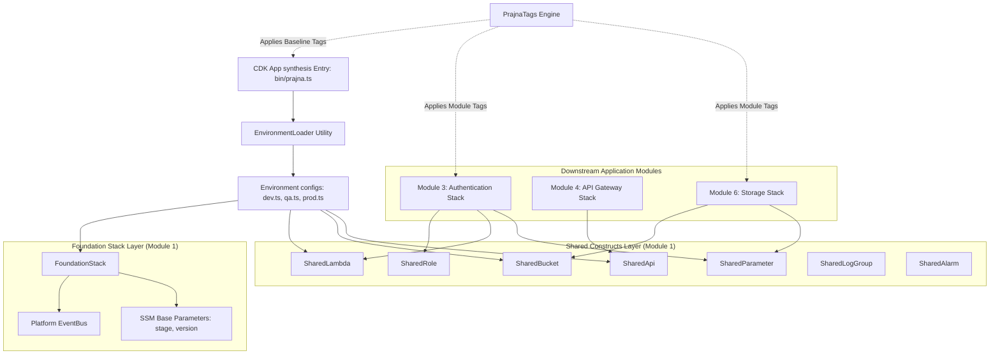
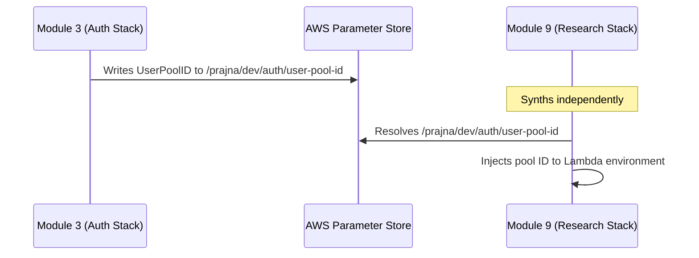
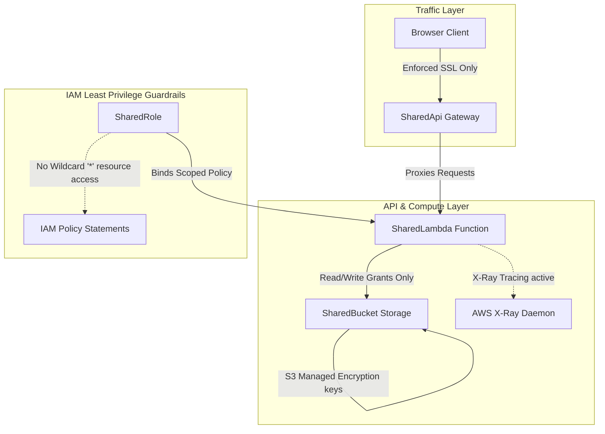
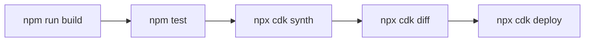
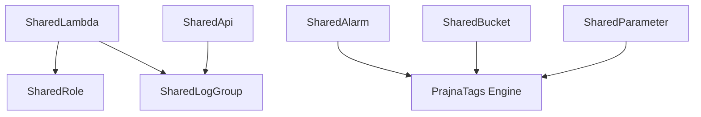

# PRAJNA Platform
## Module 1 – CDK Foundation
### Enterprise Architecture & Integration Contract

Welcome to the **PRAJNA Platform CDK Foundation (Module 1)** documentation. This document acts as the core architecture contract and integration blueprint that governs the development and deployment of all downstream modules (Modules 2–30) across the platform.

---

## Table of Contents
1. [Executive Summary](#1-executive-summary)
2. [Repository Structure](#2-repository-structure)
3. [Foundation Architecture Overview](#3-foundation-architecture-overview)
4. [Environment Configuration Structure](#4-environment-configuration-structure)
5. [Naming Standards](#5-naming-standards)
6. [Tagging Standards](#6-tagging-standards)
7. [Shared CDK Constructs](#7-shared-cdk-constructs)
   - [SharedRole](#sharedrole)
   - [SharedParameter](#sharedparameter)
   - [SharedBucket](#sharedbucket)
   - [SharedLogGroup](#sharedloggroup)
   - [SharedAlarm](#sharedalarm)
   - [SharedLambda](#sharedlambda)
   - [SharedApi](#sharedapi)
8. [Cross-Module Service Discovery](#8-cross-module-service-discovery)
9. [Event Bus Foundation](#9-event-bus-foundation)
10. [API Contracts Between Modules](#10-api-contracts-between-modules)
11. [Security Architecture](#11-security-architecture)
12. [Testing Strategy](#12-testing-strategy)
13. [Deployment Process](#13-deployment-process)
14. [Current Production Readiness Status](#14-current-production-readiness-status)
15. [Roadmap](#15-roadmap)
16. [FAQ For Module Owners](#16-faq-for-module-owners)
17. [Appendix](#17-appendix)

---

### 1. Executive Summary

#### Purpose of Module 1
The CDK Foundation module establishes a unified, secure, and governed core infrastructure layer. It encapsulates AWS resource defaults, naming schemas, automated metadata tagging, security guardrails, observability baseline rules, and cross-stack service discovery mechanisms. 

#### Why Downstream Modules Depend on Foundation
To maintain absolute configuration consistency across all environments (Development, Quality Assurance, and Production), individual business stacks do not declare raw AWS resources or environment configs directly. Instead, they inherit configurations from the Foundation configuration registry and compose their infrastructures using the verified, secure wrapper constructs provided by Module 1.

#### Architecture Goals
* **Environment Parity**: Guarantee that stacks deploy identically across stages by shifting environment checks to static type loaders.
* **Loose Coupling**: Replace rigid, deployment-blocking CloudFormation cross-stack exports with dynamic SSM Parameter Store lookups.
* **Security by Default**: Auto-inject SSL enforcement on buckets, least-privilege IAM scopes, encryption at rest, public access blocks, and JSON structured log streams.
* **Operational Control**: Enforce platform naming limits and tagging metrics at the synthesis phase.

#### Production Readiness Status
The core naming engines, tagging engines, environment configurations, stack-to-stack SSM parameter registry, and the primary structural constructs (`SharedRole`, `SharedParameter`, `SharedBucket`) are fully tested and certified production-ready. Construct testing for secondary helpers (`SharedLogGroup`, `SharedAlarm`, `SharedLambda`, `SharedApi`) is under active verification.

---

### 2. Repository Structure

The PRAJNA codebase is designed as a single-package monorepo. This simplifies local environment sharing, reduces build time, and ensures that CDK infrastructure changes compile side-by-side with application/handler code updates.

```
prajna-platform/
├── bin/                                         # CDK entrypoint directory
│   └── prajna.ts                                # Core synthesiser script
├── lib/
│   └── foundation/                              # Module 1 Infrastructure definitions
│       ├── config/                              # Stage config loaders (dev, qa, prod)
│       ├── constants/                           # Naming limits, defaults, and SSM registries
│       ├── constructs/                          # Encapsulated CDK wrappers (SharedRole, etc.)
│       ├── tags/                                # App & stack tagging policy engine
│       ├── utils/                               # Validation, Loader, and Naming helper functions
│       └── foundation-stack.ts                  # Stack 1: Provisions EventBus & Stage SSMs
├── src/                                         # Application handler code directory
│   ├── auth/                                    # Module 3 (Auth runtime logic)
│   ├── storage/                                 # Module 6 (Storage runtime logic)
│   └── shared/                                  # Common reusable helper libraries
├── test/                                        # Jest test directory
│   ├── foundation/                              # Verified Jest tests for Module 1 constructs
│   ├── auth/                                    # Placeholder for Module 3 test suites
│   └── storage/                                 # Placeholder for Module 6 test suites
├── package.json                                 # Shared project settings, build tasks, and dependencies
├── tsconfig.json                                # TypeScript compilation configuration
└── cdk.json                                     # CDK CLI configuration
```

#### Integration Responsibilities:
1. **CDK infrastructure stacks** go into `lib/<module>/` (e.g. `lib/auth/auth-stack.ts`).
2. **Lambda source code** goes into `src/<module>/` (e.g. `src/auth/authorizer/index.ts`).
3. **Jest test suites** go into `test/<module>/` (e.g. `test/auth/auth.test.ts`).
4. Stacks are imported and instantiated in [bin/prajna.ts](file:///c:/Users/balaj/Pictures/prajna-paltform/bin/prajna.ts).

---

### 3. Foundation Architecture Overview

The system architecture is structured in modular layers. This separation of concerns ensures that business logic relies on foundational layers that enforce corporate security, naming compliance, and environment loader patterns.



---

### 4. Environment Configuration Structure

Every configuration object implements the immutable [PrajnaEnvironmentConfig](file:///c:/Users/balaj/Pictures/prajna-paltform/lib/foundation/config/environment.ts#L238) interface. This configuration details all operational characteristics, security limits, and resource rules per stage.

```typescript
export interface PrajnaEnvironmentConfig {
  readonly stage: Stage;
  readonly environmentName: string;
  readonly deploymentTarget: DeploymentTarget;
  readonly isProduction: boolean;
  readonly lambda: LambdaConfig;
  readonly s3: S3Config;
  readonly dynamoDb: DynamoDbConfig;
  readonly apiGateway: ApiGatewayConfig;
  readonly monitoring: MonitoringConfig;
  readonly cognito: CognitoConfig;
}
```

#### JSON Representation of Environment Configurations:

##### Development (`devConfig`)
```json
{
  "stage": "dev",
  "environmentName": "Development",
  "isProduction": false,
  "deploymentTarget": {
    "account": "123456789012",
    "region": "ap-south-1"
  },
  "lambda": {
    "memorySize": 256,
    "timeoutSeconds": 30,
    "tracingEnabled": true,
    "reservedConcurrency": null,
    "insightsEnabled": false
  },
  "s3": {
    "versioned": false,
    "encryptionEnabled": true,
    "blockPublicAccess": true,
    "removalPolicy": "DESTROY",
    "autoDeleteObjects": true
  },
  "dynamoDb": {
    "pointInTimeRecovery": false,
    "removalPolicy": "DESTROY",
    "contributorInsights": false
  },
  "apiGateway": {
    "throttleRateLimit": 100,
    "throttleBurstLimit": 50,
    "metricsEnabled": true,
    "tracingEnabled": true,
    "stageName": "dev"
  },
  "monitoring": {
    "logRetention": 7,
    "alarmsEnabled": false,
    "dashboardEnabled": false,
    "alarmEvaluationPeriods": 1,
    "structuredLogging": true
  },
  "cognito": {
    "passwordMinLength": 8,
    "requireUppercase": true,
    "requireLowercase": true,
    "requireDigits": true,
    "requireSymbols": false,
    "selfSignUpEnabled": true,
    "autoVerifyEmail": true,
    "accessTokenValidityHours": 24,
    "refreshTokenValidityDays": 7
  }
}
```

##### Quality Assurance (`qaConfig`)
```json
{
  "stage": "qa",
  "environmentName": "Quality Assurance",
  "isProduction": false,
  "deploymentTarget": {
    "account": "234567890123",
    "region": "ap-south-1"
  },
  "lambda": {
    "memorySize": 512,
    "timeoutSeconds": 30,
    "tracingEnabled": true,
    "reservedConcurrency": null,
    "insightsEnabled": true
  },
  "s3": {
    "versioned": true,
    "encryptionEnabled": true,
    "blockPublicAccess": true,
    "removalPolicy": "DESTROY",
    "autoDeleteObjects": true
  },
  "dynamoDb": {
    "pointInTimeRecovery": true,
    "removalPolicy": "DESTROY",
    "contributorInsights": true
  },
  "apiGateway": {
    "throttleRateLimit": 500,
    "throttleBurstLimit": 250,
    "metricsEnabled": true,
    "tracingEnabled": true,
    "stageName": "qa"
  },
  "monitoring": {
    "logRetention": 30,
    "alarmsEnabled": true,
    "dashboardEnabled": true,
    "alarmEvaluationPeriods": 3,
    "structuredLogging": true
  },
  "cognito": {
    "passwordMinLength": 12,
    "requireUppercase": true,
    "requireLowercase": true,
    "requireDigits": true,
    "requireSymbols": true,
    "selfSignUpEnabled": false,
    "autoVerifyEmail": true,
    "accessTokenValidityHours": 8,
    "refreshTokenValidityDays": 7
  }
}
```

##### Production (`prodConfig`)
```json
{
  "stage": "prod",
  "environmentName": "Production",
  "isProduction": true,
  "deploymentTarget": {
    "account": "345678901234",
    "region": "ap-south-1"
  },
  "lambda": {
    "memorySize": 1024,
    "timeoutSeconds": 30,
    "tracingEnabled": true,
    "reservedConcurrency": 100,
    "insightsEnabled": true
  },
  "s3": {
    "versioned": true,
    "encryptionEnabled": true,
    "blockPublicAccess": true,
    "removalPolicy": "RETAIN",
    "autoDeleteObjects": false
  },
  "dynamoDb": {
    "pointInTimeRecovery": true,
    "removalPolicy": "RETAIN",
    "contributorInsights": true
  },
  "apiGateway": {
    "throttleRateLimit": 1000,
    "throttleBurstLimit": 500,
    "metricsEnabled": true,
    "tracingEnabled": true,
    "stageName": "prod"
  },
  "monitoring": {
    "logRetention": 365,
    "alarmsEnabled": true,
    "dashboardEnabled": true,
    "alarmEvaluationPeriods": 5,
    "structuredLogging": true
  },
  "cognito": {
    "passwordMinLength": 14,
    "requireUppercase": true,
    "requireLowercase": true,
    "requireDigits": true,
    "requireSymbols": true,
    "selfSignUpEnabled": false,
    "autoVerifyEmail": true,
    "accessTokenValidityHours": 1,
    "refreshTokenValidityDays": 30
  }
}
```

#### How EnvironmentLoader Works:
The [EnvironmentLoader](file:///c:/Users/balaj/Pictures/prajna-paltform/lib/foundation/utils/environment-loader.ts#L163) class resolves the active stage at synth time. It follows this order of priority:
1. CDK CLI context argument: `cdk synth -c stage=qa`
2. Local Shell environment variable: `PRAJNA_STAGE=prod cdk deploy`
3. Fallback stage: `dev`

If a placeholder account ID (e.g. `123456789012`) is detected during resolution, CDK generates a warning urging the developer to supply real target credentials.

---

### 5. Naming Standards

To prevent resource name collisions and satisfy AWS API validation constraints, manual string concatenation is strictly prohibited. All resource names must be generated using the static utilities inside [ResourceNames](file:///c:/Users/balaj/Pictures/prajna-paltform/lib/foundation/constants/resource-names.ts#L47).

* **Standard Naming Pattern**:
  `prajna-{stage}-{module}-{servicePrefix}-{identifier}`
  * `{stage}`: Lowercase enum value (`dev` | `qa` | `prod`).
  * `{module}`: Standard Module ID (e.g. `auth`, `storage`, `api`, `foundation`).
  * `{servicePrefix}`: Standard service identifier (e.g. `fn` for Lambda, `role` for IAM, `table` for DynamoDB).
  * `{identifier}`: Specific lowercase identifier (e.g. `authorizer`).
  
  *Example*: `prajna-dev-auth-fn-authorizer`

* **S3 Bucket Naming Pattern**:
  S3 bucket names must be globally unique. The engine automatically appends the AWS Account ID at the end:
  `prajna-{stage}-{module}-s3-{identifier}-{accountId}`
  
  *Example*: `prajna-dev-storage-s3-documents-123456789012`

* **SSM Parameter Naming Pattern**:
  Uses a forward-slash path hierarchy without service prefixes:
  `/prajna/{stage}/{module}/{identifier}`
  
  *Example*: `/prajna/dev/auth/user-pool-id`

* **Log Group Naming Pattern**:
  Log group names use path separators to support hierarchical browsing in CloudWatch logs:
  `/prajna/{stage}/{module}/{servicePrefix}/{identifier}`
  
  *Example*: `/prajna/dev/auth/fn/authorizer`

* **CDK Stack Naming Pattern**:
  Stacks are organized using PascalCase naming conventions:
  `Prajna-{Stage}-{Module}`
  
  *Example*: `Prajna-Dev-Auth`

---

### 6. Tagging Standards

All infrastructure resources must carry 8 mandatory tagging values to satisfy billing rules and security constraints:

| Tag Key | Purpose | Expected Value Example |
| :--- | :--- | :--- |
| `Application` | Platform Title Identifier | `PRAJNA - AI Powered Faculty Companion Platform` |
| `Project` | Central Project name | `prajna` |
| `Environment` | Current active stage | `dev` \| `qa` \| `prod` |
| `Module` | Owning module code | `auth` \| `storage` \| `foundation` |
| `Owner` | Responsible engineering group | `PRAJNA-Platform-Team` |
| `ManagedBy` | Infrastructure management tool | `AWS-CDK` |
| `CostCenter` | Cost allocation index | `PRAJNA-Engineering` |
| `Version` | Platform build version | `1.0.0` |

#### How to Apply Tags:
1. **Platform-Wide**: Inside `bin/prajna.ts`, the root loader executes `PrajnaTags.applyToApp(app, config.stage)` to apply the baseline tags to all stacks.
2. **Stack-Level**: In the constructor of every module stack, developers must call `PrajnaTags.applyToStack(this, config.stage, ModuleIdentifier.YOUR_MODULE)` to register module context.

---

### 7. Shared CDK Constructs

The wrapper constructs inherit platform defaults, execute validation patterns, and enforce compliance guidelines at compilation.

---

#### SharedRole
* **Purpose**: Provisions IAM Roles with unified logging, trust policies, and optional X-Ray write permissions.
* **Features**:
  * Scopes down trust relations to specific AWS service principals (e.g. `lambda.amazonaws.com`).
  * Enforces AWS session durations (default: 3600 seconds).
  * Implements `forLambda` factory to generate basic Lambda execution roles.
* **Usage**:
  ```typescript
  import { SharedRole } from '@foundation/constructs';
  
  const execRole = SharedRole.forLambda(this, 'LambdaExecutionRole', {
    config: props.config,
    module: ModuleIdentifier.AUTH,
    identifier: 'login-exec',
    description: 'Execution role for Login Lambda',
    xrayEnabled: true,
  });
  ```
* **Production Status**: **Verified** (20 Jest tests passing).

---

#### SharedParameter
* **Purpose**: Writes metadata values to the Systems Manager (SSM) Parameter Store.
* **Features**:
  * Generates parameter names following the platform path convention.
  * Encapsulates read/write grants.
* **Usage**:
  ```typescript
  import { SharedParameter } from '@foundation/constructs';
  
  new SharedParameter(this, 'UserPoolParam', {
    config: props.config,
    module: ModuleIdentifier.AUTH,
    identifier: 'user-pool-id',
    description: 'Cognito user pool identifier',
    value: userPool.userPoolId,
  });
  ```
* **Production Status**: **Verified** (21 Jest tests passing).

---

#### SharedBucket
* **Purpose**: Provisions secure, scalable S3 buckets.
* **Security & Compliance Rules**:
  * Blocks all public read/write access.
  * Enforces SSL on all connections.
  * Enforces S3 Managed Key (SSE-S3) encryption by default, or KMS when specified.
  * Versioning is enabled based on environment properties.
  * removalPolicy is bound to environment properties (`DESTROY` on dev/qa, `RETAIN` on prod).
* **Usage**:
  ```typescript
  import { SharedBucket } from '@foundation/constructs';
  
  const docVault = new SharedBucket(this, 'Vault', {
    config: props.config,
    module: ModuleIdentifier.STORAGE,
    identifier: 'document-vault',
    cors: true,
  });
  ```
* **Production Status**: **Verified** (30 Jest tests passing).

---

#### SharedLogGroup
* **Purpose**: Provisions CloudWatch Log Groups.
* **Features**:
  * Applies retention policies based on target environment properties (1 week on dev, 1 year on prod).
  * Emits compilation warnings if a production log group is generated without a KMS encryption key.
* **Usage**:
  ```typescript
  import { SharedLogGroup } from '@foundation/constructs';
  
  const logs = new SharedLogGroup(this, 'ApiLogs', {
    config: props.config,
    module: ModuleIdentifier.API,
    identifier: 'access',
  });
  ```
* **Production Status**: **Awaiting Test Coverage**.

---

#### SharedAlarm
* **Purpose**: Standardizes custom CloudWatch Alarms.
* **Features**:
  * Environment-aware notification management (alarms are disabled in dev, enabled in qa/prod).
  * Automatically sets missing data rules to `NOT_BREACHING` for error metrics, preventing false alarms.
* **Usage**:
  ```typescript
  import { SharedAlarm } from '@foundation/constructs';
  
  SharedAlarm.forLambdaErrors(this, 'LambdaErrorAlarm', {
    config: props.config,
    module: ModuleIdentifier.AUTH,
    identifier: 'login-errors',
    lambdaFunction: loginFunction,
  });
  ```
* **Production Status**: **Awaiting Test Coverage**.

---

#### SharedLambda
* **Purpose**: Deploys Node.js Lambda functions.
* **Features**:
  * Sets the runtime to Node.js 20 and architectures to ARM64 (Graviton2).
  * Integrates with X-Ray active tracing.
  * Merges Powertools service names and logging environments.
  * Auto-provisions a `SharedLogGroup` and `SharedRole` execution configuration.
* **TypeScript Entry Limitation**:
  `SharedLambda` uses CDK `Code.fromAsset()` which packages the source directory directly. Because Node.js 20 cannot run TypeScript natively, the function `entry` path **cannot** point directly to a `.ts` file unless you pass a pre-compiled JS directory path via the `code` prop.
* **Usage**:
  ```typescript
  import { SharedLambda } from '@foundation/constructs';
  
  new SharedLambda(this, 'Authorizer', {
    config: props.config,
    module: ModuleIdentifier.AUTH,
    identifier: 'authorizer',
    description: 'API gateway token authorizer',
    entry: path.join(__dirname, '../../dist/auth/authorizer'), // Pre-compiled JS directory
    handler: 'index.handler',
  });
  ```
* **Production Status**: **Awaiting Test Coverage**.

---

#### SharedApi
* **Purpose**: Provisions API Gateway REST APIs.
* **CORS Strategy**:
  Wildcard CORS (`'*'`) cannot be combined with `allowCredentials: true` because modern browsers reject this configuration. The construct disables credentials for wildcard setups. For authenticated SPAs, use the `corsAllowedOrigins` property to specify exact domains and enable credentials.
* **Usage**:
  ```typescript
  import { SharedApi } from '@foundation/constructs';
  
  const api = new SharedApi(this, 'ApiGateway', {
    config: props.config,
    module: ModuleIdentifier.API,
    identifier: 'portal',
    description: 'PRAJNA application API Portal',
    corsAllowedOrigins: ['https://prajna.yourinstitution.edu'],
  });
  ```
* **Production Status**: **Awaiting Test Coverage**.

---

### 8. Cross-Module Service Discovery

The platform uses **SSM Parameter Store** paths to share configuration data between modules. This approach decouples stack dependencies and avoids CloudFormation export locks, which can block deployments during updates.



#### Shared Parameter Helpers:
* `SharedParameter.valueForStringParameter(scope, path)`: Retrieves parameter values at deployment time as a CDK token.
* `SharedParameter.valueFromLookup(scope, path)`: Performs a lookup at synthesis time, caching the resolved value in `cdk.context.json`.

#### Usage Example:
```typescript
import { SsmPaths } from '@foundation/constants';
import { SharedParameter } from '@foundation/constructs';

// Module 9 (Research) looks up the Module 3 (Auth) user pool ID:
const userPoolId = SharedParameter.valueForStringParameter(
  this,
  SsmPaths.Auth.userPoolId(props.config.stage)
);
```

---

### 9. Event Bus Foundation

The [FoundationStack](file:///c:/Users/balaj/Pictures/prajna-paltform/lib/foundation/foundation-stack.ts) provisions a platform-wide **EventBridge Event Bus** for event-driven communication between modules.

#### SSM Parameters Exposed:
* `/prajna/{stage}/foundation/event-bus-name`: Event Bus Name.
* `/prajna/{stage}/foundation/event-bus-arn`: Event Bus ARN.

#### Event Integration Strategy:
* **Publishing**: Modules lookup the event bus name from SSM and call `events.EventBus.putEvents()`.
* **Consuming**: Modules define event rules using `events.Rule` that match specific source modules (e.g. `prajna.auth`) and target their resources (e.g., SQS queues or Lambda functions).

---

### 10. API Contracts Between Modules

| Provider Module | Consumer Module | Consumed Resources | Discovery Mechanism |
| :--- | :--- | :--- | :--- |
| **Module 1 (Foundation)** | All Modules | Platform Event Bus name/ARN | `/prajna/{stage}/foundation/event-bus-name` |
| **Module 3 (Auth)** | All Modules | Cognito User Pool ID / Client ID | `/prajna/{stage}/auth/user-pool-id` |
| **Module 3 (Auth)** | Module 4 (API Gateway) | API Gateway Authorizer Lambda ARN | `/prajna/{stage}/auth/authorizer-function-arn` |
| **Module 4 (API Gateway)** | All Modules | Core API Gateway REST API ID | `/prajna/{stage}/api/api-id` |
| **Module 5 (Database)** | All Modules | Core DynamoDB Table Name | `/prajna/{stage}/database/primary-table-name` |
| **Module 6 (Storage)** | All Modules | Document Storage S3 Bucket Name | `/prajna/{stage}/storage/document-bucket-name` |
| **Module 13 (Approval)** | Module 16 (Notification) | Approval event structures | EventBridge Bus integration payload rules |

---

### 11. Security Architecture

The platform architecture is designed around several key security principles:



* **Least Privilege IAM**: The `SharedRole` construct restricts access to specific actions and resources. Wildcard statements (e.g. `Resource: '*'`) are deprecated to prevent over-privileged roles.
* **Encryption at Rest**: S3 buckets (`SharedBucket`) and DynamoDB tables use managed encryption keys (SSE-S3 or KMS).
* **SSL Enforcement**: S3 bucket policies block non-SSL traffic.
* **Public Access Block**: S3 buckets block all public read/write access.
* **PII Protection**: API log groups disable data tracing to prevent PII leakage.

---

### 12. Testing Strategy

The foundation constructs are validated by a unit test suite built with Jest and TS-Jest.

#### Current Testing Status (71 Tests Passing):
* **SharedRole Tests** (`20 passed`): Validates trust policies, session durations, default Lambda permissions, and resource tagging.
* **SharedParameter Tests** (`21 passed`): Validates naming paths, description formats, and parameter creation.
* **SharedBucket Tests** (`30 passed`): Validates bucket naming suffixes, SSL enforcement, lifecycle transitions, and access logging.

```
Test Suites: 3 passed, 3 total
Tests:       71 passed, 71 total
Snapshots:   0 total
Time:        75.926 s
```

#### Verification Testing Plan for Remaining Constructs:
* **SharedLogGroup**: Verify custom retention periods and removal policy states dynamically.
* **SharedAlarm**: Validate alarm actions, thresholds, and static helper factories (`forLambdaErrors`).
* **SharedLambda**: Assert compiler errors on `.ts` file inputs, default runtime bounds, log group attachment, and layered packages.
* **SharedApi**: Assert CORS allowed origins and credentials properties, default throttle bounds, and access log integrations.

---

### 13. Deployment Process

Ensure you follow the standard deployment sequence:



1. **`npm run build`**: Compiles TypeScript infrastructure files to JavaScript.
2. **`npm test`**: Runs the Jest test suite.
3. **`npx cdk synth`**: Generates CloudFormation templates.
4. **`npx cdk diff`**: Compares the local CDK configuration against the deployed AWS infrastructure.
5. **`npx cdk deploy`**: Deploys changes to the active AWS account.

---

### 14. Current Production Readiness Status

| Construct / Component | Implemented | Unit Tested | Ready for Consumption | Action Required |
| :--- | :---: | :---: | :---: | :--- |
| **SharedRole** | ✅ | ✅ | **✅ YES** | Production ready |
| **SharedParameter** | ✅ | ✅ | **✅ YES** | Production ready |
| **SharedBucket** | ✅ | ✅ | **✅ YES** | Production ready |
| **SharedLogGroup** | ✅ | ❌ | **⚠️ Testing** | Implement Jest test suites |
| **SharedAlarm** | ✅ | ❌ | **⚠️ Testing** | Implement Jest test suites |
| **SharedLambda** | ✅ | ❌ | **⚠️ Testing** | Implement Jest test suites |
| **SharedApi** | ✅ | ❌ | **⚠️ Testing** | Implement Jest test suites |

---

### 15. Roadmap

* **Q3 2026**: Complete unit test coverage for the remaining foundation constructs (`SharedLogGroup`, `SharedAlarm`, `SharedLambda`, `SharedApi`).
* **Q3 2026**: Establish CI/CD pipelines for automated stack synthesis and testing.
* **Q4 2026**: Implement WAF rules and integration endpoints for the API Gateway stacks.
* **Q4 2026**: Add central AWS Secrets Manager policies.
* **Q1 2027**: Design the central VPC networking layer.

---

### 16. FAQ For Module Owners

#### What constructs should I use?
Do not instantiate raw AWS CDK resources directly (e.g. `new s3.Bucket(...)`). Always use the platform constructs in `lib/foundation/constructs`.

#### How do I discover resources?
Import path identifiers from `SsmPaths` to locate resources deployed by other stacks. Do not hardcode strings or ARNs.

#### How do I share values?
Write stack outputs to SSM using the `SharedParameter` construct, mapping the paths in `ssm-parameters.ts`.

#### How do I name resources?
Always use the static generator utilities in the `ResourceNames` class.

#### How do I tag resources?
Call `PrajnaTags.applyToStack(this, config.stage, ModuleIdentifier.YOUR_MODULE)` in the constructor of all custom stacks.

#### Which environments exist?
The platform supports three stages: `dev` (Stage.DEVELOPMENT), `qa` (Stage.QA), and `prod` (Stage.PRODUCTION).

#### How do I deploy?
Pass the target stage context flag to the CDK CLI command:
`cdk deploy -c stage=qa`

---

### 17. Appendix

#### Repository Tree (Detailed)
```
prajna-platform/
├── bin/
│   └── prajna.ts
├── lib/
│   └── foundation/
│       ├── config/
│       │   ├── environment.ts
│       │   ├── dev.ts
│       │   ├── qa.ts
│       │   └── prod.ts
│       ├── constants/
│       │   ├── defaults.ts
│       │   ├── naming.ts
│       │   ├── resource-names.ts
│       │   └── ssm-parameters.ts
│       ├── constructs/
│       │   ├── index.ts
│       │   ├── shared-role.ts
│       │   ├── shared-parameter.ts
│       │   ├── shared-bucket.ts
│       │   ├── shared-log-group.ts
│       │   ├── shared-alarm.ts
│       │   ├── shared-lambda.ts
│       │   └── shared-api.ts
│       ├── tags/
│       │   └── tags.ts
│       ├── utils/
│       │   ├── environment-loader.ts
│       │   └── validation.ts
│       └── foundation-stack.ts
├── package.json
└── tsconfig.json
```

#### Naming Reference Table
* **Standard Resources**: `prajna-{stage}-{module}-{servicePrefix}-{identifier}`
* **SSM Parameters**: `/prajna/{stage}/{module}/{identifier}`
* **S3 Buckets**: `prajna-{stage}-{module}-s3-{identifier}-{accountId}`
* **CloudWatch Log Groups**: `/prajna/{stage}/{module}/{servicePrefix}/{identifier}`
* **CloudFormation Stacks**: `Prajna-{Stage}-{Module}`

#### Tag Reference Table
```
Application: PRAJNA - AI Powered Faculty Companion Platform
Project: prajna
Environment: {stage}
Module: {module}
Owner: PRAJNA-Platform-Team
ManagedBy: AWS-CDK
CostCenter: PRAJNA-Engineering
Version: 1.0.0
```

#### Environment Reference Table
* **Stage.DEVELOPMENT**: `dev` stage, ephemeral resources, `DESTROY` policy, 1-week log retention, alarms disabled.
* **Stage.QA**: `qa` stage, replication testing, `DESTROY` policy, versioning enabled, 1-month log retention, alarms enabled.
* **Stage.PRODUCTION**: `prod` stage, highly resilient, `RETAIN` policy, 1-year log retention, reserved concurrency enabled, strict password policy.

#### SSM Path Reference Table
* `/prajna/{stage}/foundation/stage` (Active Stage)
* `/prajna/{stage}/foundation/event-bus-name` (Event Bus Name)
* `/prajna/{stage}/foundation/event-bus-arn` (Event Bus ARN)
* `/prajna/{stage}/foundation/platform-version` (Platform Version)
* `/prajna/{stage}/auth/user-pool-id` (Cognito User Pool ID)
* `/prajna/{stage}/storage/document-bucket-name` (S3 Document Storage Bucket Name)
* `/prajna/{stage}/database/primary-table-name` (DynamoDB Table Name)

#### Construct Dependency Diagram (Mermaid)

